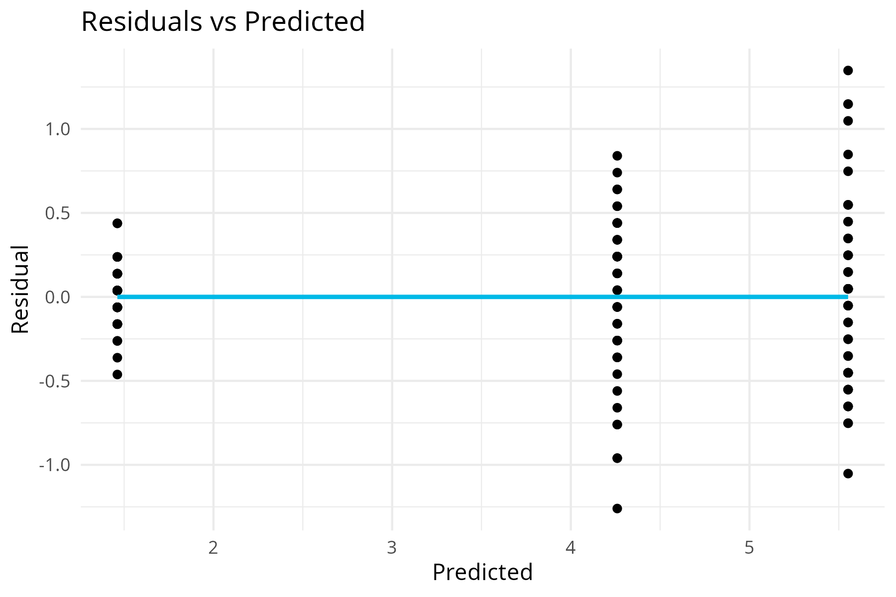
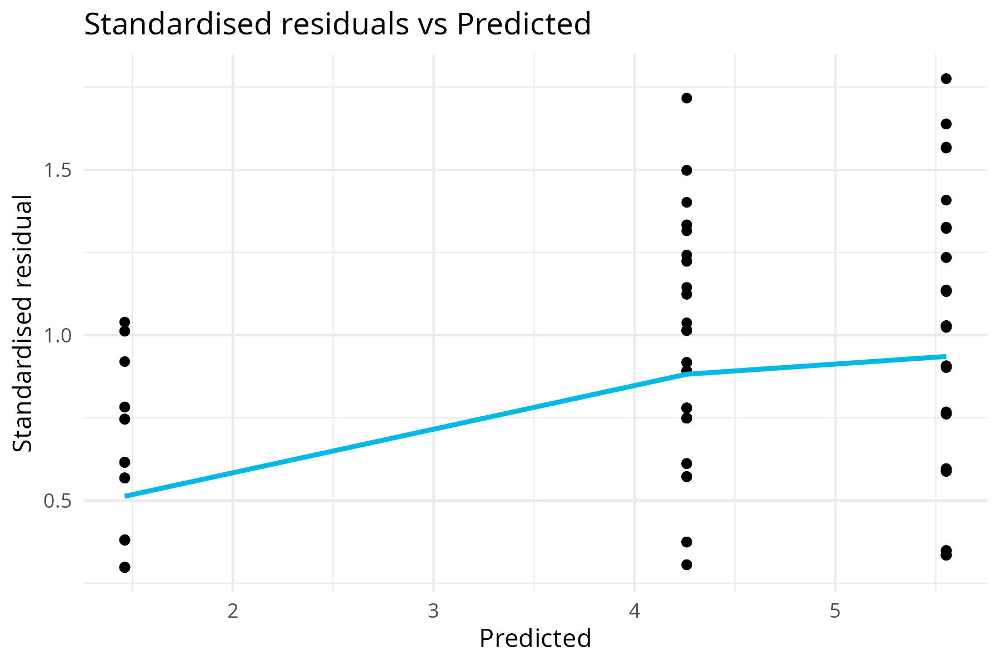

```{r, include = FALSE}
knitr::opts_chunk$set(
  collapse = TRUE,
  comment = "#>"
)
```

# Introduction
This package calculates the linear regression of a given dataset using a given formula.  

To do the estimations we used the QR decomposition, obtained with the Householder algorithm.

The output is a new S3 class vector, containing the parameters of the regression, called 'linreg'. This class has the following implemented methods 'print', 'summary', 'plot', 'coef', 'pred' and 'resid'. 

## Installation

The package can be installed with the following command.

> pak::pak("gigi133017/Lab4")

You can always check that it was successfully installed using:
```{r setup}
library(Lab4)
```

## Methods

print() : Prints in the terminal the call function of the linear regression as well as the obtained coefficients for all of the variables.

plot() : Plots and saves two different figures. ResVsPredicted.png is the regression of the residuals of the predicted values. It includes a colored solid line going through the mean of the values for each category. Std_resVsPredicted.png is the analogous with the standardized residuals.

resid() : Returns the vector of the residuals.

pred() : Returns the vector of the predicted values.

coef() : Returns a named vector with the coefficients for all of the regressors.

summary() : Prints on the terminal the coefficients, their standard erro, t-value and p-value. Also the estimated variance and degrees of freedom for the whole regression.

## Example

Here is a quick and easy example of how to implement a regression using the 'iris' dataset and this package. There are also examples of how to use the different methods.

```{r}
data(iris)
formula <- Petal.Length ~ Species
r <- linreg(formula, iris)

print(r)

coef(r)

summary(r)
```

## Plots

```{r out.width = '70%', echo = FALSE}

```

```{r out.width = '70%', echo = FALSE}

```